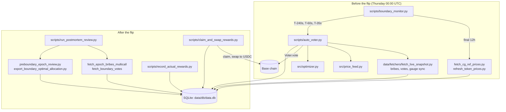

# Architecture

How the components fit together. For what the system does and why, start with the
[README](README.md); for the weekly procedure, see
[docs/OPERATIONS_RUNBOOK.md](docs/OPERATIONS_RUNBOOK.md).

## The weekly cycle

Every script is a command-line entry point that reads its settings from `.env` through
`config/`, talks to the chain over one RPC endpoint, and records what it did in a single
SQLite database. Scripts do not call each other in-process; the monitor launches the
voter as a separate process for each phase, so a crash in one phase cannot take down
the monitor.

## Components

| Component | Responsibility |
|---|---|
| [scripts/boundary_monitor.py](scripts/boundary_monitor.py) | Watches block timestamps, pre-fetches prices, triggers the three voting phases. Each check has a wall-clock deadline ([src/monitor_rpc.py](src/monitor_rpc.py)), and healthy checks ping an outside heartbeat ([src/monitor_heartbeat.py](src/monitor_heartbeat.py)). |
| [scripts/auto_voter.py](scripts/auto_voter.py) | One vote: refresh inputs, allocate, simulate, send, record the run. |
| [data/fetchers/fetch_live_snapshot.py](data/fetchers/fetch_live_snapshot.py) | Reads every gauge's current bribes and votes in batched multicalls; syncs the gauge list from the chain first. |
| [src/price_feed.py](src/price_feed.py) | Prices reward tokens from DEX router quotes, checked against CoinGecko references. |
| [src/optimizer.py](src/optimizer.py) | Marginal allocator: assigns votes in chunks to the pool with the highest marginal return, then picks a pool count. |
| [src/voting_power.py](src/voting_power.py) | Works out which account votes and how many votes the Voter contract will count for it. |
| [scripts/claim_and_swap_rewards.py](scripts/claim_and_swap_rewards.py) | Claims rewards through the escrow that owns the voting NFT, then swaps everything to USDC. |
| [scripts/run_postmortem_review.py](scripts/run_postmortem_review.py) | One-command weekly review: boundary refresh, hindsight-optimal allocation, reconciliation against received tokens. |
| [src/schema.py](src/schema.py), [src/db.py](src/db.py) | The database schema as plain SQL, and connection helpers. No ORM. |

## Data

All state lives in `data/db/data.db`, which is not committed. The schema in
[src/schema.py](src/schema.py) groups into:

- **Chain reference:** `gauges`, `gauge_bribe_mapping`, `bribe_reward_tokens`,
  `token_metadata`, `epoch_boundaries`.
- **Prices:** `token_prices` (latest), `historical_token_prices` (hourly CoinGecko
  references, plus the exact prices each vote used, so a review can value the week at
  what the voter saw).
- **Boundary snapshots:** `boundary_reward_snapshots`, `boundary_gauge_values`,
  `boundary_vote_samples`: bribes and votes read at the boundary block, for the review.
- **Execution records:** `auto_vote_runs`, `executed_allocations`,
  `claim_swap_execution_log`, `actual_epoch_rewards`.
- **Pre-boundary review:** the `preboundary_*` tables feed the T-1
  predicted-vs-boundary-optimal comparison in the post-mortem review
  (`scripts/preboundary_epoch_review.py`); its CSV outputs land in
  [analysis/pre_boundary/](analysis/pre_boundary/).

The committed record of each week's outcome is in [data/epochs/](data/epochs/).

## Design choices

- **Separate processes per phase.** The monitor must survive anything a phase does,
  including a hung RPC call or an unhandled error.
- **Prices fixed at decision time.** Each vote stores the prices it used. The review
  values the boundary at those prices, so a later price move cannot make a past
  decision look better or worse than it was.
- **Dry runs everywhere money moves.** Every script that sends a transaction has a dry
  run, and the claim script defaults to one. The voter does not: it sends a live vote
  unless given `--dry-run`, because the monitor runs it unattended. Live commands in
  [docs/VALIDATION_COMMANDS.md](docs/VALIDATION_COMMANDS.md) are labelled as such.
- **Fail loudly.** A missing ABI, or a claim run whose claims move no tokens, stops with
  an error rather than continuing on an empty value. Every vote is simulated before it
  is sent, so a vote the Voter would reject (for example, for lack of voting power)
  fails before any transaction goes out.
